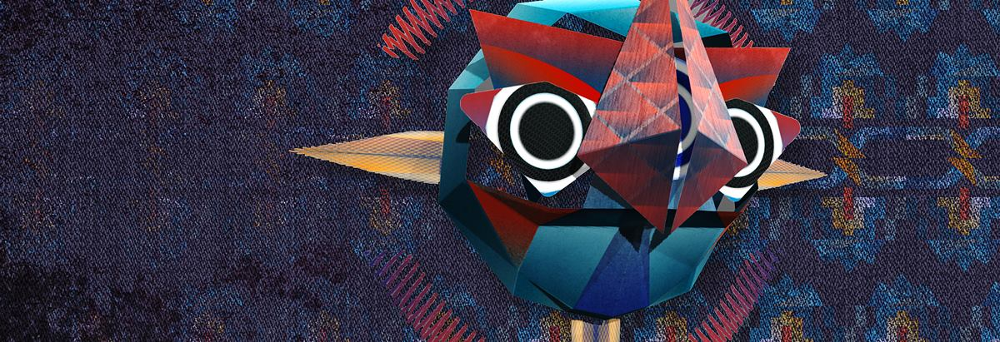

# Boyajian &middot; [](http://makeapullrequest.com)

:fire: :fire: a 3D system for performance



It's prototyped in Processing.

## 0. Table of Contents  
- [Download](#1-download)
- [Dependencies](#2-dependencies)
- [Run](#3-run)
- [Other Instructions](#3-other-instructinos)

## 1. Download

First, clone the project. Or you can just download as .zip.
```
git clone https://github.com/vibertthio/boyajian.git boyajian
cd boyajian
```

## 2. Dependencies
You need to download all the dependencies in Processing IDE.
If you have on idea how to download Processing libraries, you can follow the [instruction](https://github.com/processing/processing/wiki/How-to-Install-a-Contributed-Library) in Processing's wiki page.


- [controlP5](https://github.com/sojamo/controlp5)
- [oscP5](http://www.sojamo.de/libraries/oscP5/)
- [PeasyCam](https://github.com/jdf/peasycam)
- [Geomerative](http://www.ricardmarxer.com/geomerative/)

## 3. Run

Second, open the file ./Boyajian/Boyajian.pde with your processing IDE.
